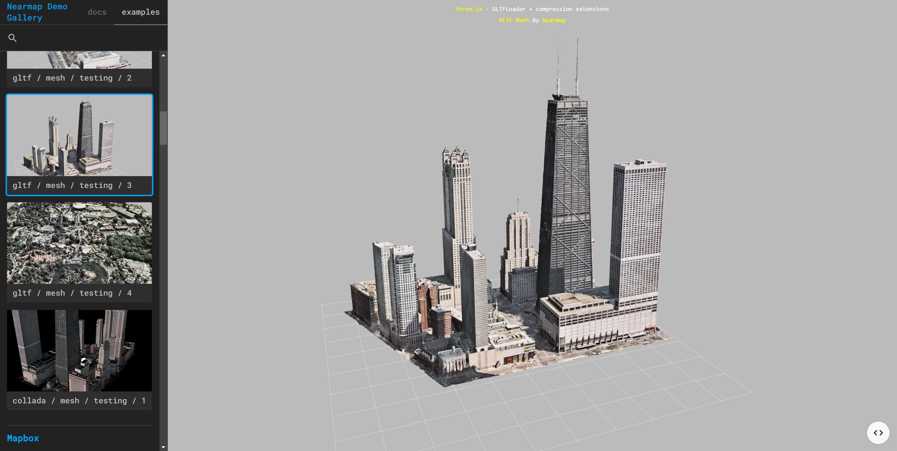
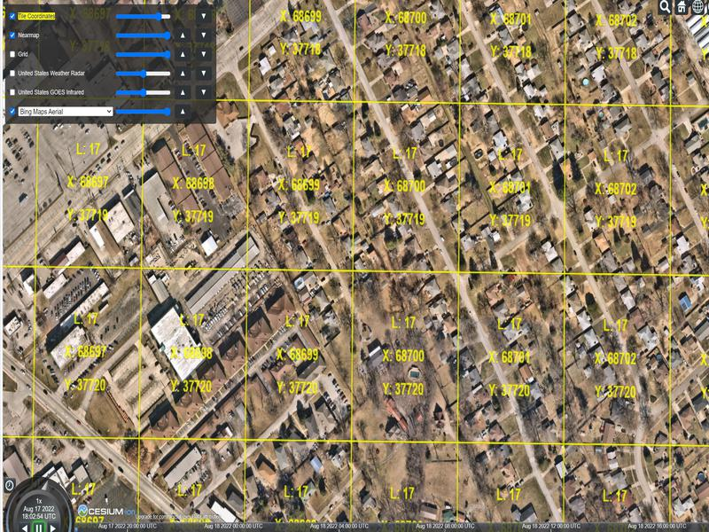
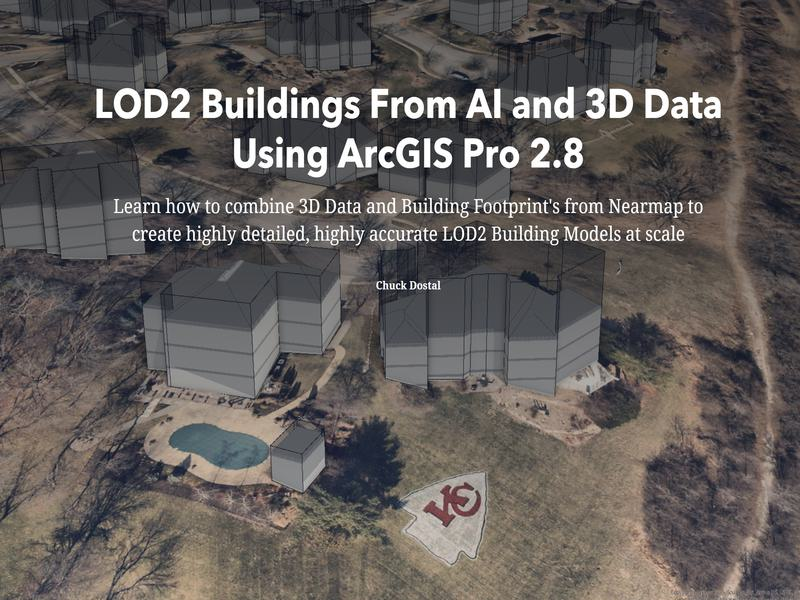
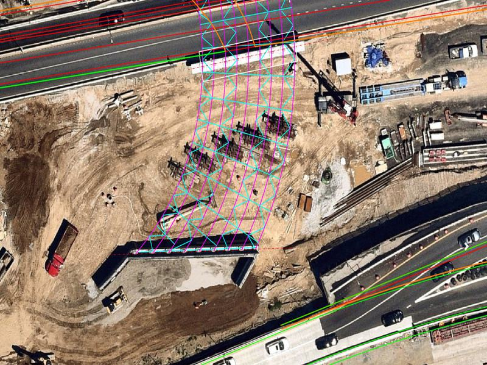

<div id="top"></div>

<!-- TABLE OF CONTENTS -->
<details>
  <summary>Table of Contents</summary>
  <ol>
    <li>
      <a href="#about-the-project">About The Project</a>
      <ul>
        <li><a href="#built-with">Built With</a></li>
      </ul>
    </li>
    <li>
      <a href="#getting-started">Getting Started</a>
      <ul>
        <li><a href="#prerequisites">Prerequisites</a></li>
      </ul>
    </li>
    <li><a href="#roadmap">Roadmap</a></li>
	<li><a href="#Index">Index</a></li>
  </ol>
</details>

<!-- ABOUT THE PROJECT -->

<h1 id="top" align="center">Nearmap Demo Gallery</h1>



## About The Project

Using Three.JS gallery fork to render a suite of nearmap content, live integrated mapping frameworks, custom apps running in browser, video content, live mesh examples (gltf works best), image slideshows, and live iframe links to story maps.

> **Note:** This repository originated as an older project (~4 years ago) and has undergone major improvements to developer experience and documentation.

### Recent Major Improvements

- **Modernized dev setup** – `npm start` for local server, `.env.example` for optional env-based config, clearer Quick Start and API Keys Setup instructions

Notes:

- Best use for easy access during sales calls or for live event demo gallery
- Easy viewing in browser
- fast load times with custom lighting settings
- Codebase can be used to populate larger scale example Gallery Pages.
- Codebase Still being updated.

Please keep up to date with the repo, as this is still in development. Node JS Depolyment. Can run standard JS Live-Servers

<p align="right">(<a href="#top">back to top</a>)</p>

### Built With

This section lists any major frameworks/libraries used to bootstrap your project.

- [Node.js](https://nodejs.org/en/)
- [Three.js](https://threejs.org/)

<p align="right">(<a href="#top">back to top</a>)</p>

<h1 id="top" align="center">Supported Content Types and Examples</h1>

<h2 id="top" align="center">Mesh Viewer</h2>

<div align="left">Mesh Viewer is leveraging a number of supported viewers through the three.js viewer library. 
This content is being rendered in browser. The content being shown are all files stored locally in the project which means rendering times are kept minimal. The most optimized is GLTF currently, this file type needs to be convered in freeware like blender from OBJ to GLTF bindary.


Currently Supported Mesh formats are: OBJ, GLTF, Collada, XYZ.</div>

<h2 id="top" align="center">Mapping Framework Live Integrations Viewer (mapbox, openlayers, esrijs, googlemaps</h2>
<div align='left'> Nearmap content can be leveraged within a variety of common third party mapping frameworks such as Mapbox, EsriJS, google maps, cesium webmaps and openlayers. The Gallery has a variety of examples showing content within these mapping frameworks including high res raster data in tile formats, wms, mesh data, and AI vector data. ALl of these maps are live coded so in the event a client needs a code base to get started these examples can be shared easily. Example images below are not exhaustive, please see the index list at end of README. </div>

<p align="center">
  
</p>

<h3 align='center'> Nearmap Integration into third party mapping framework (cesium here) </h3>
<p><br></p>

<h2 id="top" align="center">Storymap Integrations Viewer</h2>
<div align='left'> Storymaps are a key focus of the SE team to enable sales and easy demo of content showing value propositions of the Nearmap data stack. The gallery viewer supports story map hosting through iframe integrations.</div>



<h2 id="top" align="center">Integrated Video Viewer</h2>

<div align='left'> Nearmap has a massive inventory of high fidelity and valueable video content. The Demo Gallery viewer enables storing high res video files and then rending them on demand in the gallery. This facilitiates fast last times infront of clients, a lack of dependence on wifi and a way quickly access the existing video content. </div>


<h2 id="top" align="center">Photogallery Viewer </h2>

<div align='left'> Uses Boostrap CDN connection. Photo files are being stored locally in order to improve the time it takes to find example images and load times. First photo gallery viewer was for AEC on an example project but its recommeneded to add more later. </div>



<!-- GETTING STARTED -->

## Getting Started

**Important:** This app must be run through a local web server. Opening `index.html` directly in a browser (file://) will not work—styles will fail to load and fetch requests will be blocked.

### Quick Start

1. **Install dependencies** (optional, for dev):
   ```sh
   npm install
   ```

2. **Configure API keys** (see [API Keys Setup](#api-keys-setup) below)

3. **Start the dev server** (from the project folder):
   ```sh
   npm start
   ```
   Then open **http://localhost:3000** in your browser. The root `index.html` is the main gallery.

### Alternative: VS Code Live Server

1. Install the [Live Server](https://marketplace.visualstudio.com/items?itemName=ritwickdey.LiveServer) extension.
2. Right-click `index.html` → "Open with Live Server".
3. The gallery will open at the URL shown (e.g. http://127.0.0.1:5500).

### Alternative: Python

```sh
# Python 3
python -m http.server 3000

# Then open http://localhost:3000
```

### API Keys Setup

**Important:** This demo requires API keys for mapping integrations. Never commit real keys to version control.

1. Copy the template file:
   ```sh
   cp examples/keys.js.example examples/keys.js
   ```
2. Edit `examples/keys.js` and add your keys:
   - **NEARMAP_KEY** – [Nearmap API](https://docs.nearmap.com/display/ND/Work+with+API+Keys)
   - **MAPBOX_KEY** – [Mapbox](https://account.mapbox.com) (public token, `pk.*`)
   - **GOOGLE_KEY** – [Google Maps JavaScript API](https://console.cloud.google.com)
   - **CESIUM_ION_TOKEN** – [Cesium Ion](https://cesium.com/ion/) (for 3D Cesium examples)

3. `keys.js` is in `.gitignore` – it will not be committed.

### Prerequisites

- npm
  ```sh
  https://nodejs.org/en/
  ```
  ```sh
  https://threejs.org/
  ```

  API keys used by examples:
  - Nearmap
  - EsriJS
  - Google Maps
  - Cesium Ion
  - Mapbox

<!-- ROADMAP -->

## Roadmap

- [ ] multipage renderings
- [ ] Download OBJ sample button add.
- [ ] Content editions.

<p align="right">(<a href="#top">back to top</a>)</p>

## Index

```sh
{
  "3D GLFT Mesh Sample Area": [
    "obj_gltf_mesh_1",
    "obj_gltf_mesh_2",
    "obj_gltf_mesh_3",
    "obj_gltf_mesh_4",
    "obj_gltf_mesh_5",
    "obj_gltf_mesh_6",
    "obj_gltf_mesh_7",
    "obj_gltf_mesh_8",
    "obj_gltf_mesh_9",
    "obj_gltf_mesh_10",
    "obj_gltf_mesh_11",
    "obj_gltf_mesh_12",
    "obj_mesh_hartford",
    "obj_mesh_liberty",
    "obj_mesh_sofi"
  ],
  "Mapbox": [
    "nearmap_mapbox_lod2_buildings",
    "nearmap_mapbox_gltf_mesh_render",
    "nearmap_mapbox_vectorAI",
    "nearmap_mapbox_vectorAI_boulder",
    "nearmap_mapbox_tile_source",
    "nearmap_mapbox_terrain"
  ],
  "Openlayers": [
    "nearmap_openlayers_tile_custom_app",
    "nearmap_openlayers_coverage_map_custom_app"
  ],

  "Arcgis Javascript SDK": [
  "nearmap_arcgis_javascript_sdk_2D_sample",
  "nearmap_arcgis_javascript_sdk_2D_and_3D",
  "nearmap_arcgis_javascript_sdk_2D_sample_swipe",
  "nearmap_arcgis_javascript_sdk_2D_wms",
  "nearmap_arcgis_javascript_sdk_2D_wmts",
	"nearmap_3d_content_multiview_esri"
  ],

  "Google Maps": [
    "nearmap_google_maps_tile_integration"
  ],

  "Cesium": [
  "nearmap_cesium_3d_integration",
  "nearmap_cesium_3d_integration_new_york",
  "nearmap_cesium_3d_integration_new_york_highway"
],

"Custom Nearmap Widget": [
"nearmap_widget_mapboxGL_side_by_side",
"nearmap_widget_google_streetview"
],

  "ESRI": [
    "nearmap_vector_AI_gen_3",
    "nearmap_arcgis_pro_video_rendering_multiview",
    "nearmap_arcgis_vector_AI_Colorado_Sample",
    "nearmap_arcgis_pro_LOD2_fused_buildings",
    "nearmap_arcgis_pro_LOD2_Plesanton_CA",
    "nearmap_arcgis_pro_Flordia_Transportation_Cooridor_Study",
    "nearmap_arcgis_pro_point_cloud",
    "nearmap_arcgis_pro_LOD2_buildings_Ocean_City_NJ",
    "nearmap_arcgis_pro_solar_analysis"

  ],

  "Dashboards": [
    "nearmap_dashboard_impact_response",
    "nearmap_dashboard_veg_management_kc",
    "nearmap_vector_AI_insurance_roof_conditions",
    "nearmap_dashboard_Impact_response_deploy"


  ],

  "Storymaps": [
    "nearmap_storymap_DEM_DSM",
    "nearmap_storymap_impact_response",
    "nearmap_storymap_LOD2_production",
    "nearmap_storymap_public_works",
    "nearmap_storymap_telco",
    "nearmap_storymap_transportation",
    "nearmap_storymap_utilities",
    "nearmap_storymap_insurance",
    "nearmap_storymap_3ds_max",
    "nearmap_storymap_land_planning",
    "nearmap_storymap_property_assessment",
    "nearmap_storymap_urban_enviornment",
    "nearmap_storymap_digital_twin",
    "nearmap_storymap_claims_and_cotastrophes"
  ],

  "Transactional API": [
    "tx_api_roof_assessments",
    "tx_api_download_all"
  ],

  "Video Gallery": ["nearmap_video_arcpro_point_cloud_updates",
  "nearmap_video_arcpro_watershed_delineation",
  "nearmap_video_arcpro_urban_development_timelapse",
  "nearmap_video_solar_analysis"
],

  "Video Renders": [
    "nearmap_twinmotion_rendering_1",
    "nearmap_twinmotion_rendering_2",
    "nearmap_twinmotion_rendering_3",
    "nearmap_twinmotion_rendering_4",
    "nearmap_twinmotion_rendering_5",
    "nearmap_video_classified_lidar_vs_pc",
    "nearmap_video_insurance_AI_labelled",
    "nearmap_video_massport_video",
    "nearmap_video_Mexico_Beach_Video",
    "nearmap_video_Newcastle_flyover",
    "nearmap_video_san_jose_highway",
    "nearmap_video_SJO_flyover",
    "nearmap_video_UNCW_campus_webscene"

  ],

  "Engineering Design": [
    "nearmap_openroads_3D_datastack",
    "nearmap_AEC_slideshow_examples",
    "nearmap_cesium_ion_example",
    "nearmap_cesium_ion_KGI",
    "nearmap_infraworks_full_dataset"
  ]
}


```

<p align="right">(<a href="#top">back to top</a>)</p>
